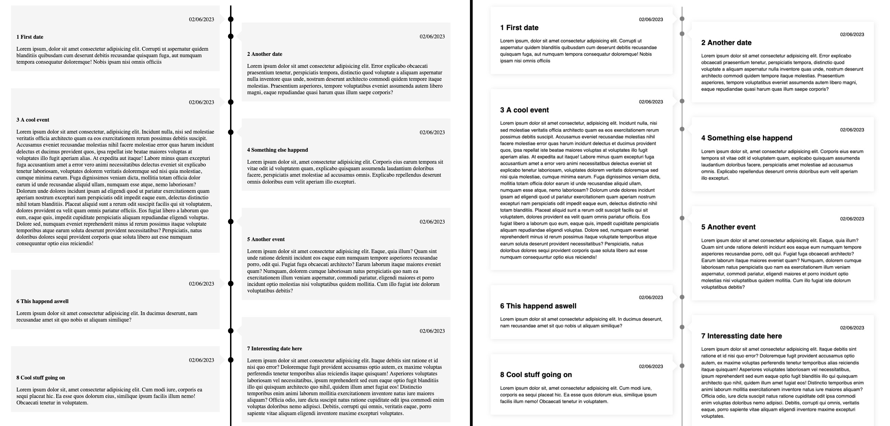

# react-alternating-timeline

A compact, masonry style alternating timeline react component which is fully customizable.



## Features

- 🎛️ Customize everything.
- 🎨 Consistent ([BEM](https://getbem.com)) class naming for easy styling with CSS, emotion...
- ⏰ Date formatting using [date-fns](date-fns.org) standard.
- ⚖️ Alternating, left or right positioning.
- 🖼️ Render images and custom content.
- 🪄 Built with Typescript.

## Installation

Add the package with the package manager via NPMs or GitHubs registry of choice to your project:

- **yarn**: `yarn add react-alternating-timeline`
- **npm**: `npm install react-alternating-timeline`
- **pnpm**: `pnpm add react-alternating-timeline`
- **npx**: `npx -p react-alternating-timeline`

## Usage

```ts
import { Timeline, TimelineItemsProps } from 'react-alternating-timeline';

const items: TimelineItemsProps = [
  {
    key: 'first',
    date: new Date(),
    title: 'Special event!',
  },
  {
    key: 'second',
    date: new Date(),
    title: 'Event',
    children: ,
  },
  ...
];

<Timeline items={items} />;
```

## API

The available properties of the `Timeline` component:

| Property                | Type                                          | Description                                                                                                                                   | Default         |
| :---------------------- | :-------------------------------------------- | :-------------------------------------------------------------------------------------------------------------------------------------------- | :-------------- |
| `items`                 | [`TimelineItemsProps`](#timelineitemsprops)   | Array of timeline items                                                                                                                       |                 |
| `positioning?`          | `'alternating' \| 'left' \| 'right'`          | How the items should be positioned relative to the timeline                                                                                   | `'alternating'` |
| `gap?`                  | `number`                                      | The horizontal gap between timeline items                                                                                                     | 50 (`px`)       |
| `offset?`               | `{ left?: number; right?: number } \| number` | Offset left or right items from the top (default offset when passing just a `number`: `right`)                                                | 50 (`px`)       |
| `minMarkerGap?`         | `number`                                      | The minimum gap markers will have between each other                                                                                          | 50 (`px`)       |
| `defaultPointerOffset?` | `number`                                      | The regular top offset pointers have to their item card                                                                                       | 40 (`px`)       |
| `dateLocal?`            | `Local`                                       | Date locale                                                                                                                                   |                 |
| `dateFormat?`           | `string`                                      | Specific date format according to date-fns [specification](https://date-fns.org/v2.29.3/docs/format). Ignored when passing a `string` as date | `'P'`           |
| `customMarker?`         | `ReactElement`                                | Custom maker element replacing the default                                                                                                    |                 |
| `customPointer?`        | `ReactElement`                                | Custom pointer element replacing the default                                                                                                  |                 |
| `styleConfig?`          | [`StyleConfig`](#styleconfig)                 | Style config object for customizing timeline by setting css custom properties                                                                 |                 |
| `className?`            | `string`                                      | Additional class name                                                                                                                         |                 |

### TimelineItemsProps

An array of the following properties:

| Property         | Type                | Description                                                                      |
| :--------------- | :------------------ | :------------------------------------------------------------------------------- |
| `key`            | `Key`               | Unique key for each item                                                         |
| `title?`         | `string`            | Optional title paragraph displayed bold                                          |
| `date`           | `Date    \| string` | Date either being formatted according to provided format or passed as a `string` |
| `children?`      | `ReactNode`         | Pass custom content as `children` to the component                               |
| `dateFormat?`    | `string`            | Overwriting `dateFormat` property of parent `Timeline`                           |
| `dateLocale?`    | `string`            | Overwriting `dateLocale` property of parent `Timeline`                           |
| `customMarker?`  | `ReactElement`      | Overwriting `customMarker` property of parent `Timeline`                         |
| `customPointer?` | `ReactElement`      | Overwriting `customPointer` property of parent `Timeline`                        |

### StyleConfig

The style can either be passed as a javascript object...

```ts
{
  line?: {
    width?: string;
    color?: string;
  };
  marker?: {
    size?: string;
    color?: string;
    radius?: string;
  };
  pointer?: {
    height?: string;
    width?: string;
  };
  card?: {
    background?: string;
    radius?: string;
    offset?: string;
    shadow?: string;
    padding?: string;
  };
};
```

...or the custom properties can be set directly in css

```css
.timeline {
  --line-width: 0.2rem;
  --line-color: black;
  --marker-size: 1rem;
  --marker-color: var(--line-color);
  --marker-radius: 50%;
  --pointer-height: 2rem;
  --pointer-width: 1rem;
  --card-background: whitesmoke;
  --card-radius: 0.1rem;
  --card-offset: 1rem;
  --card-shadow: unset;
  --card-padding: 1rem;
}
```

(These are the default values)

## Demo

View a full demo of component as storybook: [Storybook](https://openscript-ch.github.io/react-alternating-timeline/) 📗
